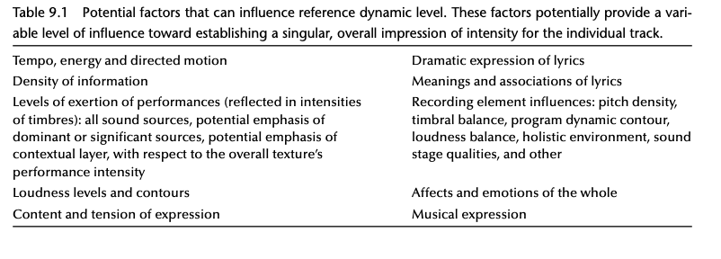
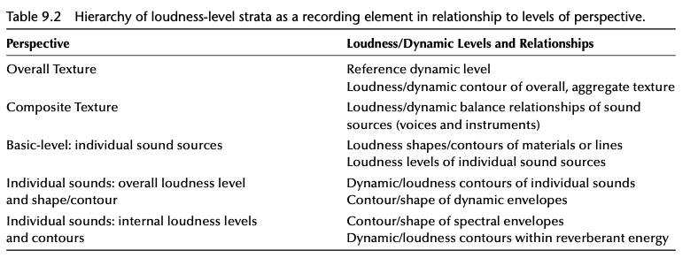
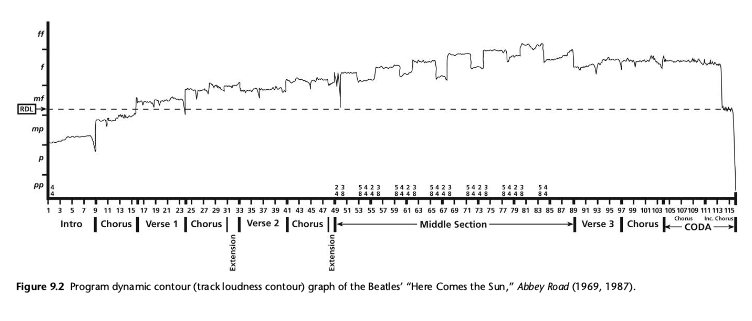

+++
title = "Loudness, the Confluence of Domains and Deep Listening"
outputs = ["Reveal"]
[reveal_hugo]
theme = "moon"
margin = 0.2
separator = "##"
+++

## Loudness

- Loudness is the perceived magnitude of sound; it is the sensation of the amplitude of the waveform.
- Also, it has a different subjective meaning to everyone in different contexts
- Environment context impacts ‘loud and soft’
- perceived loudness can be increased without changing the actual sound level

---

## Loudness as a recording element

- We have a lot of control over loudness in the recording process
- Loudness can create surreal relationships of sounds
- Because of this level of control loudness in recording is not the same as dynamics in live music

{}
**Loudness can create surreal relationships of sounds,** where gentle whispers can be incorporated at very loud levels, and instruments performed with great exertion are altered so the timbre generated by such a performance appears at a subdued loudness level in the mix; the balanced mixture of sound sources that comprise the track’s aggregate texture need not reflect acoustic realism.
{}

---

## Prominence and Loudness

- Attention itself can play a role in loudness perception
- An unexpected event can seem louder, even though it isn't
  - hi-hat entrance in Phil Spector’s mix of “Let It Be” (Let It Be, 1970) at 0:53.
  - Compare to the 2021 mix to hear any differences in loudness

{}
There is a prominent hi-hat entrance in Phil Spector’s mix of “Let It Be” (Let It Be, 1970) at 0:53. The instrument is not the loudest in the mix. It is prominent because it is the first appearance of a percussion sound in the track, and it is a new addition to the texture. The listener’s attention is likely immediately captured by the new sound that is unlike anything that has preceded it—though they may also remain engaged in the lead vocal melody or the content of the lyrics. unusual spatial identity becomes pronounced as its delayed iterations provide movement on the sound stage. Never is it the loudest sound, or the track’s most significant aesthetic voice. Whether or not it is more prominent than the lead vocal rests in the attention of the listener. Shifting one’s focus of attention between the lead vocal, piano and hi-hat, one might experience a shift in loudness accompanying a shift in prominence, or awareness. Recognizing this shift in prominence can lead toward experiencing the sensation of loudness decoupled from other aspects of sound.
{}

---

## Loudness in the Context of the Track

- dynamics differ from loudness in that they reflect timbral characteristics, energy, expression, intensity;
- As a recording element, the sensation of loudness is understood within the context of the track.
- Reference dynamic level (RDL)
  - a holistic impression of all of the sounds of the track and their musical materials and performances

---

## RDL

---

## Overall Loudness Level of the Track

{}
At the highest level of perspective, the track is distilled to a single sensation of loudness; we perceive this level to change continually and to form a contour across the entire track.

This can also be called the "program dynamic contour" or "track loudness contour"

The track loudness contour is the single loudness-level of the track’s aggregate sound; it is the result of the combination of all source loudness levels. It helps some to envision this sensation and concept by thinking of a single VU (voltage unit) meter that displays a representation of the signal level, following the loudness level of the program as it potentially changes at every moment.
{}

---

{}
Figure 9.2 illustrates the changes in overall loudness level throughout the track “Here Comes the Sun” (1969, 1987). The graph contains the reference dynamic level of the track, against which the contour can be heard. Imbedded in the contour are shapes of loudness that correspond to structural divisions; as the shapes emerge within one’s hearing of the track, their role in defining sections through their repetition becomes apparent. The loudness shape of the track is clearly evident from its beginning at the lower portion of mp to its peak within ff. The wide dynamic range of the track contains subtle changes of loudness as well as large and sudden shifts.

“Here Comes the Sun” is among the uncommon tracks in which the reference dynamic level is prominently experienced. During the final moments of the coda, the level of the track loudness contour matches the track’s RDL; the reference dynamic level is audible as the track’s overall loudness arrives at the track’s overall sense of energy, exertion, and expression (that is the RDL). At this moment, the low mf RDL delivers a sense of arrival and a settling in the place of the conception and expression in which the track exists. It is common for a track to arrive at its RDL as an important occurrence, but it is not common for it to be a point of arrival that provides aesthetic closure to a track.
{}

---

- Listen with LUFS meter routing through Reaper
- Compare to some newer songs using LUFS
- [MLoudnessAnalyzer](https://www.meldaproduction.com/download/documentation/MLoudnessAnalyzer.pdf)
