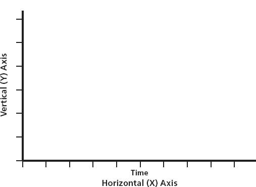

+++
title = "Moylan - A System for Evaluating Sound"
outputs = ["Reveal"]
[reveal_hugo]
theme = "moon"
margin = 0.2
separator = "##"
+++

## Moylan: Chapter 6

### A System for Evaluating Sound

---

| Element of Sound | Evaluation Graphs and Processes                                |
| ---------------- | -------------------------------------------------------------- |
| Time             | Timeline of song; with structure, phrase, and text indications |
|                  | Sound sources against timeline                                 |
| Pitch            | Melodic contour                                                |
|                  | Pitch area                                                     |
|                  | Pitch Density                                                  |

---

| Element of Sound | Evaluation Graphs and Processes |
| ---------------- | ------------------------------- |
| Dynamics         | Dynamic Contour                 |
|                  | Sound-quality evaluation        |
|                  | Timbral balance                 |

---

| Element of Sound   | Evaluation Graphs and Processes          |
| ------------------ | ---------------------------------------- |
| Spatial properties | Distance location                        |
|                    | Stereo location and surround location    |
|                    | Sound stage                              |
|                    | Perceived performance environment        |
|                    | Environmental Characteristics of sources |

---

## Graphing the States and Activity of Sound Components

{}
Time increments will be selected for the X-axis that are appropriate for the sound. Time increments will take one of two forms: (1) units based on the second (millisecond, tenths of seconds, groups of seconds, etc.), and (2) units based on the metric grid (individual or subdivisions of pulses, measures, or groups of measures).
{}

<!-- ---

## Time units

Listen to [tracks 26–33](https://routledgetextbooks.com/textbooks/9780415842815/audiotracks.php) for exercise in developing skills in judging (recognizing) short time units.

{}
If the sound material being evaluated is not in a musical context, increments based on the second must be used. It will be common to use increments based on the second in the evaluation of timbre relationships (including sound quality and environmental characteristics). Envisioning a pulse of MM:60 (or an integer or a multiple thereof) will provide some reference to the listener in making time judgments without a metric grid, but this activity may not always be appropriate. It may distort the listener’s perception of the material, and the reference may be unstable, as the listener’s attention will rightly be focused elsewhere.
{} -->

---

**Multilayered example**

---

- Open [diagrams.net](https://app.diagrams.net/?src=about)
- [Shortcuts:](https://app.diagrams.net/shortcuts.svg)
- everyone create a chart similar to Moylan's with an X/Y axis
  - save if for later use

{}
We'll keep refining this and going back to it through the semester. But for now let's at least learn how to create the basic template and edit it.
{}
