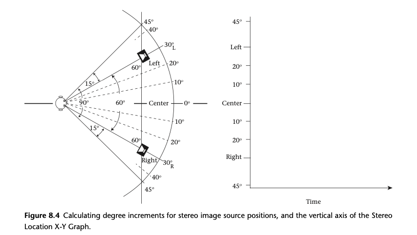
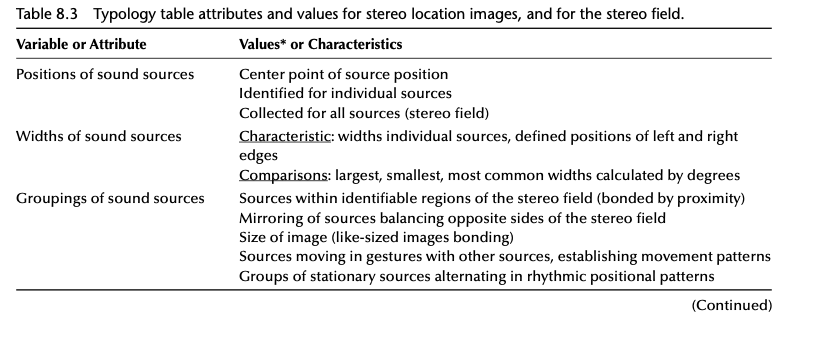
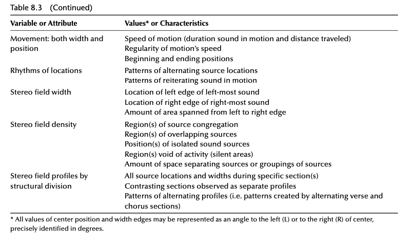

+++
title = "The Illusion of Space as an Element of Recording - Part 2"
outputs = ["Reveal"]
[reveal_hugo]
theme = "moon"
margin = 0.2
separator = "##"
+++

## Sound sources in motion

- Shifts happen between song sections
- Shifts in location can also come with shifts in width/size

{}
Last thursday we talked about shifting image sizes and widths. Image locations can also shift. These shifts are likely to happen between sections of a track, such as verses or choruses.

{}

---

## Dynamic Shifts

- Dynamic shifts are also possible, but less common
  - Ex: the end of the introduction to Abbey Road’s “Here Comes the Sun” (1969)
    - It seems to "introduce" the vocals and the right side of the image
  - Ex: lead vocal in Abbey Road's “You Never Give Me Your Money”

{}

Motion can be gauged by the amount of movement, or the difference between the starting and ending positions. For example, at the end of the introduction to Abbey Road’s “Here Comes the Sun” (1969) a Moog sound travels from the left loudspeaker to the center of the stereo field. The speed of movement, and the consistency of that speed represent other variables; here the sound moves steadily over the span of 4 beats. The image’s width remains stable throughout its motion.

Returning to Abbey Road, the** lead vocal in “You Never Give Me Your Money”** begins the song as a narrow image. It soon begins to gradually grow wider, until it occupies a significant portion of the stereo field; the sound’s environment contributes to this change with its gradual addition and varying qualities of cues and its changing proportion with the direct source sound. In the second section of the track, a new lead vocal sound gradually moves from the right to the left side of the sound stage; throughout the movement, the spread image maintains a similar size.

Motion between sounds may be present in a track. In this case a rhythmic structure can be estab- lished by interacting sounds located in different locations. The changing locations add spatialization to the rhythms, changes in timbres may also be present. Such occurrences are common in percus- sion parts, though examples between other instruments (especially instruments of the rhythm section) and voices (between lead and background locals) abound. **Peter Gabriel’s “In Your Eyes” (1986) binds numerous percussion and drum sounds into a “spatialized rhythmic structure” (Théberge 1989, 104) that presents a strong rhythmic pattern between the instruments spread widely across the sound stage.**
{}

---

## Observing Stereo Images

---

Stereo Image Graph Example

---

Ways of writing about stere image:

---

